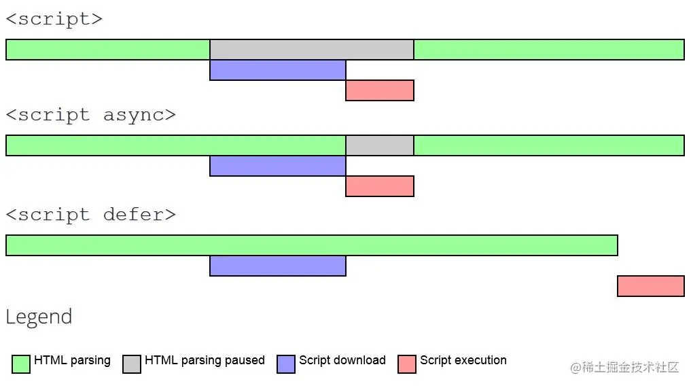

# \<script\>标签的默认行为及其常用属性

在HTML里使用javaScript代码的主要方法就是通过<script\>标签包裹行内代码或通过<script\>标签的src属性引入外部代码。

## 两种使用方法如下

``` html
<!-- 通过外部文件引入 -->
<script src="demo.js"></script>

<!-- 行内javaScrip代码 -->
<script>
  function sayScript() {
    console.log("</script>");
  }
</script>

```

## 默认行为如下

#### 下载外部JS文件和执行JS代码会阻塞html渲染

通过<script\>标签注入的行内代码或外部文件代码在被执行完成之前，后面的html内容是会被阻塞的，不显示的，前提是它们没有使用**defer**和**async**属性。
注：（阻塞时间主要包含下载外部文件的时间与执行JS代码的时间）

这是一个js执行会阻塞html渲染的demo
``` html
<html>
  <head>
    <meta charset="utf-8">
    <script>
      // 阻塞代码运行一段时间
      function blocked(duration) {
        const start = Date.now()
        while (Date.now() - start < duration) {}
        console.log('这段代码执行完毕，耗时' + duration / 1000 + '秒')
      }
    </script>
  </head>
  <body>
    <script>
      blocked(2000)
    </script>

    <!-- 我会在上面这段js执行完成后才显示 -->
    <h1>script标签阻塞渲染测试，我将在上面js代码执行完成后才显示</h1>
  </body>
</html>
```

#### <script\>标签的代码会严格按照它们在网页中出现的顺序被执行

浏览器会按照<script\>在页面中出现的顺序依次执行它们，前提是它们没有使用**defer**和**async**属性；第二个<script\>元素的代码必须在第一个<script\>元素的代码执行完成后才能开始执行，第三个则必须等第二个执行完，以此类推。

#### 通过使用<noscript\>标签指定在浏览器不支持js时显示的内容。
现代浏览器没有不支持js脚本的，但可以设置成禁用js脚本，被禁用或者不支持js脚步运行时，会显示<noscript\>标签内容，可作为优雅的降级处理方案.

```html
<html>
  <head>
    <script>
      console.log('hi')
    </script>
  </head>
  <body>
  <noscript>
    <p>浏览器不支持js脚步时，我会显示出来，不然你永远看不到我。</p>
  </noscript>
  </body>
</html>
```

#### 当src引入的外部代码和行内代码同时存在时，只会执行外部代码，忽略行内代码

```html
<html>
  <head>
    <!-- 我只会下载并执行src="index.js"的代码 -->
    <script src="index.js">

      // 这里不会执行
      console.log('hi')
    </script>
  </head>
  <body>
  
  </body>
</html>
```


## 常用属性如下

#### src 
表示要引入的外部文件地址，这个地址不受浏览器同源策略限制，可以来自不同的域，**但受HTTP/HTTPS协议的限制**，比如当前域协议是https的，加载http域的资源会受同源策略限制，反正当前域是http协议加载https资源则不受限制


#### async
异步加载脚本，只适用于通过src引入的脚本，当浏览器遇到async脚本表示可以立即开始下载脚本，但不能阻塞页面后续行为，需等待下载完后再执行，执行过程是会阻塞后续加载行为的。

- async脚本执行于文档顺序无关，哪个先加载完就先执行哪个
- async脚本会保证在页面load事件之前执行
- async脚本可能会在DOMContentLoaded事件之前或之后执行，DOMContentLoaded事件和async脚本不会互相等待，谁先加载完就优先安排谁

#### defer
延迟执行脚本，只适用于通过src引入的脚本，当浏览器遇到defer脚本表示可以立即开始下载脚本，不能阻塞页面后续行为，必须等到html解析完成后再执行
- defer脚本会保证在页面load事件之前执行
- defer脚本按照它们出现的顺序执行
- defer脚本在DOMContentLoaded事件之前执行


## 图解浏览器解析script过程

