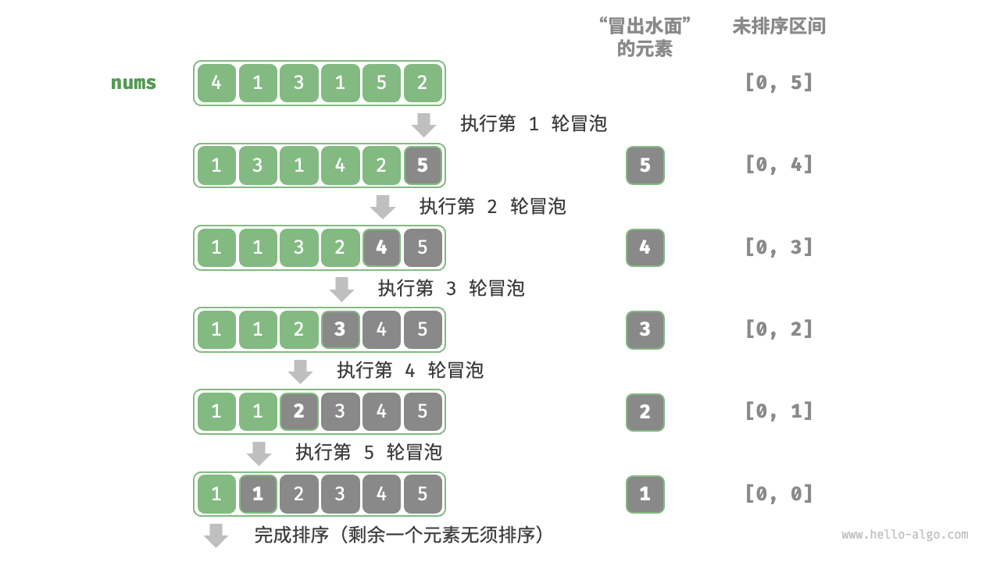

# 冒泡排序的原理及其实现

#### 原理

开启一个循环，每轮循环从左往右遍历，依次比较相邻元素大小，如果“左元素 > 右元素”就交换二者位置，最大的元素就会被移动到数组最右侧，这个排序过程称为冒泡排序。


**算法执行过程如下**

设置数组长度为n

1. 初始状态下，所有元素未排序，即未排序的索引区间为[0, n - 1]。
2. 开始第一轮冒泡，通过不断的交换位置，最大的元素会出现在数组最右侧，这时未排序的索引区间为[0, n - 2]
3. 开始第二轮冒泡，通过不断的交换位置，最大的元素会出现在未排序区间最右侧，这时未排序的索引区间为[0, n - 3]
4. ...
5. 以此类推，经过n - 1轮冒泡后，前n-1大的元素都会被交换至正确位置。
6. 仅剩的一个元素必定是最大元素，无需排序，因此数组排序完成。




#### 代码实现

```js

/* 冒泡排序 */
function bubbleSort(nums) {
  // 外循环：未排序区间为 [0, i]
  for (let i = nums.length - 1; i > 0; i--) {
    // 内循环：将未排序区间 [0, i] 中的最大元素交换至该区间的最右端
    for (let j = 0; j < i; j++) {
      if (nums[j] > nums[j + 1]) {
        // 交换 nums[j] 与 nums[j + 1]
        let tmp = nums[j];
        nums[j] = nums[j + 1];
        nums[j + 1] = tmp;
      }
    }
  }

  return nums
}

```


#### 冒泡排序特征
- 时间复杂度为o(n²)
- 空间复杂度为o(1)，指针i和j占用内存空间，是原地排序，不额外增加内存空间
- 稳定排序，相同的元素不会导致相对位置发生变化